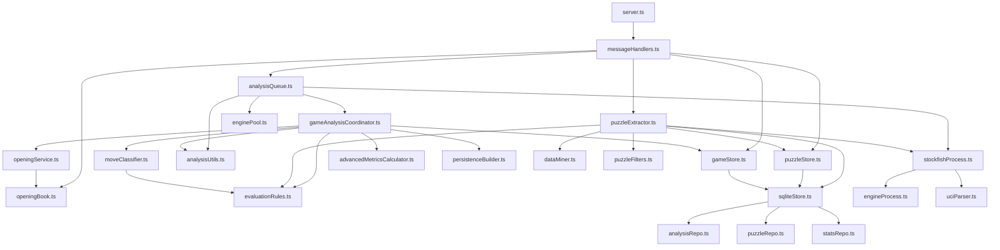

# 🏗️ Backend Architecture: Chess Analysis System
> **Agent Guide** — Lee esto completo antes de modificar cualquier archivo. Es la fuente de verdad para contratos de datos, dependencias entre módulos y decisiones de diseño críticas.

---

## ⚠️ Reglas Críticas Antes de Tocar Cualquier Cosa

1. **Fuente de Verdad Única** — El backend es ahora el único encargado de la lógica de ajedrez. El frontend ha sido limpiado de archivos duplicados como `evaluationRules.ts`, `openingService.ts` y `chessMath.ts`.
2. **Coherencia de Versiones** — Aunque el front ya no tenga lógica, cualquier cambio en la clasificación o precisión debe documentarse aquí para que la UI sepa qué labels esperar.
3. **El engine es una máquina de estados** — nunca envíes comandos UCI sin verificar el estado actual. Enviar `go` mientras está en `SEARCHING` corrompe la salida.
4. **Cada sesión WebSocket tiene su propia instancia de engine** — no hay estado compartido entre clientes.
5. **`cancel()` es la única forma segura de interrumpir** — no mates el proceso directamente.

---

## 📊 Dependencias entre Módulos



**Radio de impacto:** Cambiar `chessMath.ts` o `evaluationRules.ts` afecta todos los resultados de análisis. Cambiar `engineProcess.ts` afecta toda la comunicación con el engine. Cambiar `uciParser.ts` solo afecta la extracción de datos crudos del motor. Cambiar `sqliteStore.ts` o los repositorios bajo `storage/repositories` afecta a toda la persistencia del sistema.

---

## 📡 Contrato WebSocket API

**Endpoint:** `ws://localhost:9001` — una instancia de Stockfish por conexión.

### Mensajes Entrantes (Cliente → Servidor)

| `type` | Campos Requeridos | Campos Opcionales |
| :--- | :--- | :--- |
| `analyze_position` | `fen`, `moveIndex` | `threads`, `hash`, `multiPv`, `depth` |
| `analyze_game` | `history`, `currentIndex`, `gameId` | `engineConfig: { depth, multiPv, threads, hash }`, `startFen`, `playerColor`, `win`, `timeControl`, `playerWhite`, `playerBlack`, `opponent`, `gameDate`, `times` |
| `analyze_games` | `games: Array` (partidas a analizar) | `engineConfig: { depth, multiPv, threads, hash }` |
| `cancel` | — | — |
| `clear_cache` | — | `gameId` |
| `extract_puzzles` | `games: Array<{ pgn, history, gameId }>` | `engineConfig: { depth, threads, hash }` |
| `cancel_extraction` | — | — |
| `get_puzzles` | — | — |
| `delete_puzzle` | `id` | — |
| `puzzle_solved` | `id` | — |
| `clear_puzzles` | — | — |
| `get_stats` | — | `filters`, `requestId` |
| `get_stat_details` | `category` | `filters`, `requestId` |
| `get_analyses` | — | `offset`, `limit` |
| `get_analysed_ids` | — | — |
| `delete_analyses` | `ids: string[]` | — |
| `get_full_analysis` | `gameId` | — |
| `get_move_explorer` | `fen` | — |
| `get_book_moves` | `fen` | — |
| `get_server_config` | — | — |

> **`puzzle_solved`:** Llama a `PuzzleStore.incrementSolved(id)` → delega a `SqliteStore.incrementPuzzleSolved(id)` para persistir el incremento de `solvedCount` directamente en la base de datos SQLite.

#### Schema: campo `history` en `analyze_game`
Array de objetos generados por `chess.history({ verbose: true })` de chess.js:
```typescript
Array<{
  san:   string,  // Notación estándar (ej: "Nf3") — usado para visualización
  lan:   string,  // Notación larga (ej: "g1f3")   — usado para comunicarse con Stockfish
  from:  string,  // Casilla origen (ej: "g1")
  to:    string,  // Casilla destino (ej: "f3")
  piece: string,  // Tipo de pieza (ej: "n")
  color: string,  // "w" | "b"
  flags: string,  // Flags de chess.js (ej: "n", "c", "e", "p", "k", "q")
  // ...otros campos de chess.js (promotion, captured, etc.)
}>
```
> El backend usa principalmente `san` y `lan`. Los demás campos están disponibles pero no son críticos para el análisis.

#### Campo `games` en `extract_puzzles`
`pgn` e `history` son alternativos pero complementarios:
- Si existe `history` → se usa directamente.
- Si `history` es nulo pero existe `pgn` → el extractor parsea el PGN para generar el historial.
- Si ambos fallan → el juego se omite silenciosamente.

---

### Mensajes Salientes (Servidor → Cliente)

| `type` | Payload | Descripción |
| :--- | :--- | :--- |
| `position_progress` | `{ score, mate, bestMove, moveIndex, lines: Line[] }` | Streaming del engine. `score` en escala −10 a 10. |
| `position_result` | `{ score, mate, bestMove, moveIndex, lines: Line[] }` | Resultado final de posición única. |
| `move_result` | `{ index, label, score, mate, bestMove, lines: Line[], isBook, errorTimeClass }` | Resultado por ply durante `analyze_game`. |
| `opening_detected` | `{ openingName, ecoCode, openingPly, bookPlies: number[] }` | Metadatos de apertura. |
| `complete` | `{ accuracy: { white: number, black: number }, accuracyByPhase: any[] }` | Precisión final de la partida. |
| `status` | `{ running: boolean }` | Estado del engine. |
| `progress` | `{ pct: number, label: string }` | Progreso general de la tarea actual. |
| `cancelled` | — | Confirmación de cancelación de análisis. |
| `puzzle_extraction_started` | `{ totalGames }` | Inicio del proceso de extracción masiva. |
| `puzzle_game_done` | `{ gameIndex, total, extractedCount, totalExtracted }` | Notificación de fin de proceso de un juego individual. |
| `puzzle_extraction_complete` | `{ totalExtracted }` | Fin de la tarea masiva de extracción. |
| `extraction_cancelled` | — | Confirmación de cancelación de extracción. |
| `puzzle_list` | `{ puzzles: Puzzle[] }` | Lista de puzzles guardados. |
| `puzzle_deleted` | `{ id, success }` | Confirmación de borrado. |
| `puzzles_cleared` | — | Confirmación de limpieza de librería. |
| `error` | `{ message: string, requestId?: string }` | Notificación de error. |
| `batch_analysis_started` | `{ gameIndex, total, gameId }` | Inicio de análisis en lote para un juego. |
| `batch_analysis_progress` | `{ gameIndex, pct, label }` | Progreso parcial de un juego en el lote. |
| `batch_analysis_game_complete`| `{ gameIndex, accuracy }` | Fin de análisis de un juego del lote. |
| `batch_analysis_complete` | `{ total }` | Fin de todo el análisis en lote. |
| `batch_analysis_cancelled` | — | Cancelación del análisis en lote. |
| `batch_move_result` | `{ gameIndex, index, label, isBook, errorTimeClass }` | Resultado por jugada en análisis por lote. |
| `stats_data` | `{ requestId, stats }` | Datos de estadísticas agregadas del dashboard. |
| `stat_details_data` | `{ requestId, category, details }` | Detalle específico por categoría de estadística. |
| `analyses_list` | `{ analyses, offset, limit, total }` | Partidas analizadas paginadas en memoria. |
| `analysed_ids` | `{ ids }` | Listado rápido de IDs de partidas ya analizadas. |
| `analyses_deleted` | `{ ids }` | Confirmación de eliminación en lote de análisis. |
| `full_analysis_data` | `{ gameId, data }` | JSON del análisis completo de una partida. |
| `move_explorer_data` | `{ fen, whitePerspective: any, blackPerspective: any }` | Frecuencias y resultados agregados para un FEN. |
| `book_moves` | `{ fen, moves, opening, eco, source }` | Opciones de teoría desde el libro local. |
| `server_config` | `{ openingSource, bookSize }` | Parámetros del servidor activo al conectar. |

#### Schema: tipo `Line`
```typescript
{
  multipv: number,       // Índice de la línea (1 = mejor)
  depth:   number,       // Profundidad alcanzada
  score:   number,       // Visual Score (−10 a 10)
  mate:    number | null,// Mate en N, null si no hay
  pv:      string,       // Variante completa UCI (ej: "e2e4 e7e5 g1f3")
  move:    string        // Primer movimiento UCI (ej: "e2e4")
}
```
> **Importante:** A diferencia de Stockfish puro (centipeones), el backend ya envía el `score` transformado a **Visual Score (−10 a 10)** mediante `ChessMath.cpToVisualScore`.

---

## 🚀 Flujos de Análisis

### 1. Live Position (Posición Única)
- El backend recibe `analyze_position`.
- Se cancela cualquier tarea previa mediante el mutex de `AnalysisQueue`.
- Se inicializa Stockfish con el config recibido.
- Se envía `isready` -> `readyok` -> `position fen` -> `go depth`.
- Se streamean resultados parciales (`position_progress`) y el final (`position_result`).

### 2. Full Game Analysis (Partida Completa)
- Se orquesta mediante `GameAnalysisCoordinator`.
- **Paralelo:** `OpeningService` consulta el libro local (TSV) y Lichess (fallback).
- **Secuencial:** Se analizan los plies priorizando la posición actual y la siguiente (`buildAnalysisOrder`).
- Cada ply se clasifica usando `MoveClassifier` (espera a la apertura si es ply <= 30).
- Al terminar, se calcula la precisión global por bando.

### 3. Extracción de Puzzles
- Se analizan los juegos con `multiPv: 2`.
- Se identifican errores (`Error` o `Error grave`) con pérdida de WP >= 0.15.
- Se guarda el puzzle con la posición **después** del error (FEN donde el rival debe castigar).
- La `solutionSequence` se extrae de la PV del engine (hasta 6 movimientos).

---

## 🧩 Máquina de Estados del Engine

```
        spawn()
DEAD ──────────► STARTING
                     │  UCI handshake (uci -> uciok -> setoptions -> isready -> readyok)
                     ▼
               ◄── IDLE ──► [isready] ──► IDLE
               │      │
  bestmove     │      │  go depth N
  recibido     │      ▼
               └── SEARCHING
                     │  stop enviado
                     ▼
                  STOPPING
                     │  bestmove recibido (descartado)
                     ▼
                    IDLE
```

**Regla estricta:** Solo enviar `go` desde `IDLE`. Solo enviar `stop` desde `SEARCHING`. La barrera `isready/readyok` limpia estado pendiente antes de cada análisis.

---

## 🛡️ Mutex y Cancelación Asíncrona

`AnalysisQueue` y `PuzzleExtractor` implementan un **mutex de sesión única**. Llamar a `cancel()` garantiza:
1. Envía `stop` a Stockfish si está en `SEARCHING` de forma síncrona.
2. Utiliza `AbortController` para interrumpir orquestaciones async en curso (`GameAnalysisCoordinator` o el loop de Puzzles).
3. El engine queda en `IDLE` listo para el siguiente comando.

**ACK Asíncrono:**
El servidor WebSocket (`src/server.ts` y `messageHandlers.ts`) **nunca** envía el mensaje `{"type": "cancelled"}` de forma síncrona dentro del bloque `case 'cancel'`.
En su lugar, confía en que `signal.aborted` rompa los loops de ejecución activos. Una vez que el loop en curso confirma la interrupción (ej. catch de `AbortError`), lanza los callbacks `onCancelled` o `onExtractionCancelled`, los cuales finalmente emiten el ACK al frontend. 
Esto evita una condición de carrera ("double-cancelled race") donde el frontend podría asumir erróneamente que una tarea murió antes de que el motor haya liberado sus procesos de red y CPU.

---

## ⚙️ Configuración del Engine (Defaults)

| Contexto | Depth | Threads | Hash (MB) | MultiPV |
| :--- | :--- | :--- | :--- | :--- |
| Backend (default) | 18 | `Math.max(1, CPUs − 1)` | 128 | 1 |

**Threads:** Mínimo forzado a 1 vía `Math.max(1, CPUs - 1)`. Sin máximo duro configurado; por convención deja un núcleo libre para el OS y el servidor WebSocket.

---

## 🌍 Opening Service

- **Libro Local:** Indexa archivos TSV (a.tsv a e.tsv) en memoria al startup. Indexa **todas las posiciones intermedias** de cada línea, no solo la final.
- **Modo Exclusivo:** No cuenta con fallbacks externos (ej: Lichess Explorer API). Utiliza 100% el libro TSV local.
- **Cache:** Mantiene un caché de las últimas 100 partidas consultadas.
- **Límite de Profundidad:** El análisis se ejecuta secuencialmente sobre todo el historial de movimientos de la partida hasta el límite físico estricto de `MAX_BOOK_PLY = 30` plies.

---

## 🧮 Fórmulas Matemáticas Clave

### CP → Win Probability (WP)
```
WP = 1 / (1 + e^(-0.00368208 * cp))
```
Resultado en `[0.0, 1.0]`. 0.5 = tablas.

### CP → Visual Score
```
visualScore = cp / 100    // rango: [-10.0, 10.0] (clamped)
```
Si hay mate, se asigna +/- 10.0.

### Umbrales de Clasificación (`evaluationRules.ts`)
Calculados sobre la pérdida de WP (`wpBefore - wpAfter`).

| Label | Condición |
| :--- | :--- |
| Brillante | Ganancia WP ≥ 0.05 AND es el mejor movimiento del engine |
| Mejor | Es el mejor movimiento del engine (pero sin ganancia crítica) |
| Excelente | Pérdida WP ≤ 0.02 |
| Bueno | Pérdida WP ≤ 0.05 |
| Imprecisión | Pérdida WP ≤ 0.10 |
| Error | Pérdida WP ≤ 0.20 |
| Error grave | Pérdida WP > 0.20 |
| Libro | Marcado por el OpeningService |

### Cálculo de Precisión
No es un promedio simple. Usa una función de decaimiento exponencial sobre la pérdida de centipeones (derivada de WP) y combina media aritmética y armónica para penalizar errores graves más fuertemente.
```
acc = Math.max(0, 103.1668 * Math.exp(-0.07354 * lossPct) - 3.1669)
```

---

## 🗄️ Esquema de Tabla SQLite: `puzzles`

El almacenamiento de puzzles está 100% migrado a la base de datos **SQLite** (tabla `puzzles`), gestionado por `SqliteStore` y `PuzzleRepo`.

```sql
CREATE TABLE IF NOT EXISTS puzzles (
    id                   TEXT PRIMARY KEY,  -- UUID auto-generado
    createdAt            TEXT,              -- ISO Date
    fen                  TEXT,              -- FEN DESPUÉS del blunder (posición para resolver)
    solutionSequence     TEXT,              -- Movimientos UCI de solución concatenados (JSON array stringified)
    solvedCount          INTEGER DEFAULT 0, -- Veces resuelto por el usuario
    
    -- Contexto de Partida y Jugada
    baseFen              TEXT,              -- FEN 2 plies antes de la jugada del blunder
    contextMoves         TEXT,              -- Movimientos previos inmediatos (JSON array)
    originalContinuation TEXT,              -- Continuación original de la partida (JSON array)
    preBlunderFen        TEXT,              -- FEN antes de jugar el blunder
    playedMove           TEXT,              -- El movimiento UCI erróneo que gatilló el puzzle (blunder)
    label                TEXT,              -- Clasificación de la jugada errónea ("Error" | "Error grave")
    puzzleType           TEXT,              -- Tipo de puzzle ("mate" | "tactical_blunder")
    mateIn               INTEGER,           -- Movimientos para dar mate (null si es táctico general)
    
    -- Métricas de Evaluación
    wpLoss               REAL,              -- Pérdida de probabilidad de victoria (0.0 a 1.0)
    preBlunderWp         REAL,              -- Probabilidad de victoria antes del blunder (0.0 a 1.0)
    playerColor          TEXT,              -- Color del jugador que resuelve ("white" | "black")
    gameId               TEXT,              -- ID de la partida origen
    ply                  INTEGER,           -- Ply de la jugada errónea
    
    -- Minería de Datos Enriquecida (DataMiner.ts)
    blunderSeverity      REAL,              -- Severidad matemática del error
    tensionIndex         REAL,              -- Índice de tensión posicional (piezas en conflicto)
    attackedSquares      INTEGER,           -- Cantidad de casillas bajo ataque simultáneo
    isOnlyMove           INTEGER,           -- 1 si la primera jugada de la solución era la única salvación, 0 si no
    criticalityGap       REAL,              -- Distancia de evaluación con el segundo mejor movimiento
    tacticalMotifs       TEXT               -- Motivos tácticos detectados en formato JSON array stringified
);
```

---

## 🛠️ Utilidades: `analysisUtils.ts`

| Función | Descripción |
| :--- | :--- |
| `buildPositions(history)` | Repite los movimientos para generar el array de FENs de toda la partida. |
| `buildAnalysisOrder(total, currentIndex)` | Devuelve índices priorizados: `[currentIndex, currentIndex+1, currentIndex-1, ...resto 0..N]`. |
| `mapLines(lines, isBlackTurn)` | Normaliza las líneas del engine a Visual Score para el frontend. |

---

## ⚠️ Manejo de Errores

| Escenario | Comportamiento |
| :--- | :--- |
| Crash del proceso Stockfish | `engineProcess.js` emite `onDied` → intenta respawn → error al cliente si falla |
| FEN inválido | Validado en `stockfishProcess.js` → `{ type: 'error', message: '...' }` |
| Engine colgado | `cancel()` es el único fallback. No hay timeout automático. |
| API de apertura no responde | Continúa sin datos de apertura tras 2 reintentos fallidos |
| `games` sin `history` ni `pgn` válido | El juego se omite silenciosamente en `extract_puzzles` |
| Cliente desconectado | Kill del proceso hijo y liberación de recursos de la sesión |

---

## 🏁 Secuencia de Startup

1. `openingBook.js` indexa los archivos TSV en memoria. Debe completarse antes de servir cualquier `analyze_game`.
2. `service.js` inicia el servidor WebSocket en `ws://localhost:9001`.
3. Los procesos Stockfish se crean **lazy** en la primera conexión, no en el startup.