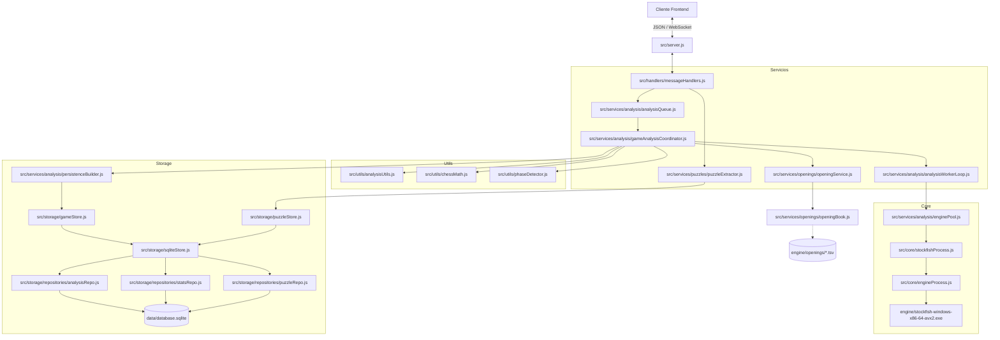
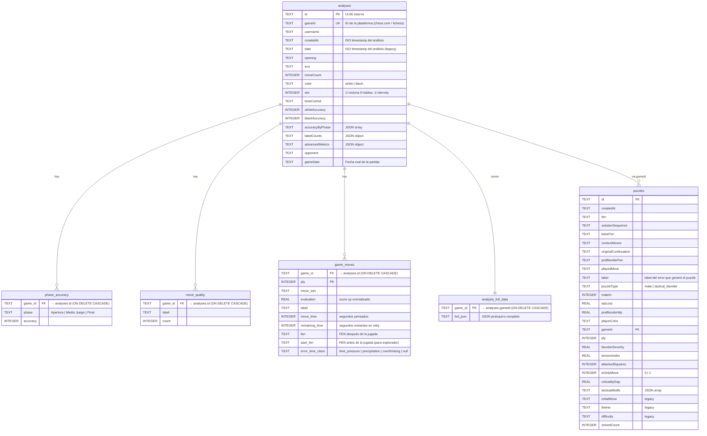

# Guía de Arquitectura del Backend — `backendTablero`

> **Para agentes**: Esta guía está diseñada para que puedas realizar cambios correctos en el backend sin leer todo el código fuente. Sigue este orden: (1) identifica el archivo correcto en §2, (2) consulta los anti-patrones en §8 antes de escribir código, (3) usa las recetas de §9 para tareas comunes.

---

## Tabla de Contenidos

1. [Vista General del Sistema](#1-vista-general-del-sistema)
2. [Mapa de Archivos y Responsabilidades](#2-mapa-de-archivos-y-responsabilidades)
3. [Mapa de Dependencias entre Módulos](#3-mapa-de-dependencias-entre-módulos)
4. [Modelo de Datos — Esquema SQLite](#4-modelo-de-datos--esquema-sqlite)
5. [Protocolo WebSocket — Catálogo de Mensajes](#5-protocolo-websocket--catálogo-de-mensajes)
6. [Algoritmos y Constantes Clave](#6-algoritmos-y-constantes-clave)
7. [Configuración del Entorno](#7-configuración-del-entorno)
8. [Anti-patrones Críticos — Qué NO hacer](#8-anti-patrones-críticos--qué-no-hacer)
9. [Recetas de Tareas Comunes](#9-recetas-de-tareas-comunes)
10. [Flujo de Datos Paso a Paso: Análisis de Partida](#10-flujo-de-datos-paso-a-paso-análisis-de-partida)

---

## 1. Vista General del Sistema

Servidor WebSocket local (`ws://127.0.0.1:9001`) que orquesta Stockfish (binario local) y SQLite para análisis de partidas de ajedrez. Sin red requerida en producción.

```
Cliente Frontend
      │  JSON sobre WebSocket
      ▼
  server.js ──► messageHandlers.js
                     │
          ┌──────────┼──────────────┐
          ▼          ▼              ▼
   AnalysisQueue  PuzzleExtractor  GameStore/PuzzleStore
          │
    ┌─────┴──────────────────┐
    ▼                        ▼
GameAnalysisCoordinator   StockfishProcess (análisis en vivo)
    │
    ├── EnginePool ──► [N × StockfishProcess]
    ├── AnalysisWorkerLoop
    ├── OpeningService
    ├── MoveClassifier
    ├── AdvancedMetricsCalculator
    └── PersistenceBuilder ──► GameStore ──► SQLite
```



---

## 2. Mapa de Archivos y Responsabilidades

> **Lectura rápida**: Encuentra la columna "Qué hace" y la columna "Cuándo modificar".

### 2.1. Inicialización y Comunicación

| Archivo | Qué hace | Cuándo modificar |
|---|---|---|
| `src/server.js` | Entry point. HTTP + WebSocket en puerto 9001. Crea `AnalysisQueue` y `PuzzleExtractor` por cliente. Llama `OpeningBook.load()` y `GameStore.runIntegrityCheck()` al arrancar. | Cambiar puerto, añadir lifecycle hooks, cambiar política de conexión. |
| `src/handlers/messageHandlers.js` | Router de mensajes JSON entrantes. Mapea `msg.type` → función handler. | **Añadir un nuevo tipo de mensaje** (ver receta §9.1). |

### 2.2. Core Stockfish

| Archivo | Qué hace | Cuándo modificar |
|---|---|---|
| `src/core/engineProcess.js` | Wrapper de bajo nivel: `child_process.spawn()`, stdin/stdout pipes, buffer de líneas. | Cambiar el binario, gestión de errores de proceso, timeouts de I/O. |
| `src/core/stockfishProcess.js` | Protocolo UCI: `init()`, `analyzePosition()`, `newGame()`, `stop()`, `destroy()`. Gestiona `AbortSignal`. Defaults: `depth=18`, `multiPv=3` en live. | Cambiar parámetros UCI, agregar opciones del motor, cambiar timeout (`movetime 30000`). |
| `src/core/uciParser.js` | Parser de líneas UCI (`info depth X score cp Y pv Z`) → objetos JS. | Añadir soporte para nuevas líneas UCI del motor. |

### 2.3. Servicios de Análisis

| Archivo | Qué hace | Cuándo modificar |
|---|---|---|
| `src/services/analysis/analysisQueue.js` | Orquesta la sesión del motor. Mutualmente excluyente: análisis de posición vs. partida. Expone `analyzePosition()`, `analyzeGame()`, `analyzeGames()`, `cancel()`, `destroy()`. | Cambiar política de cancelación, agregar nuevos modos de análisis. |
| `src/services/analysis/gameAnalysisCoordinator.js` | Orquestador principal de análisis de partida completa. Coordina apertura + worker loop en paralelo. Llama a `PersistenceBuilder` y `GameStore.save()` al finalizar. | Cambiar el flujo de análisis, añadir nuevos callbacks de progreso. |
| `src/services/analysis/enginePool.js` | Crea N engines `StockfishProcess` (1 hilo c/u). Divide `threads` y `hash` equitativamente. Acepta `prebuiltEngines` en modo batch (no re-spawnea). | Cambiar la estrategia de distribución de recursos. |
| `src/services/analysis/analysisWorkerLoop.js` | Distribuye posiciones FEN entre los engines del pool. Prioriza `currentIndex`. | Cambiar orden de análisis, estrategia de asignación de motores. |
| `src/services/analysis/moveClassifier.js` | Clasifica cada jugada: `Libro`, `Brillante`, `Mejor`, `Excelente`, `Bueno`, `Imprecisión`, `Error`, `Error grave`, `Insta-move Blunder`, `Deep-think Blunder`, `Time Pressure Error`. | Cambiar umbrales de clasificación o añadir nuevas etiquetas. |
| `src/services/analysis/evaluationRules.js` | Fórmulas de precisión por jugada y precisión total (media híbrida). | Cambiar la función de precisión o la fórmula de la media. |
| `src/services/analysis/advancedMetricsCalculator.js` | Calcula `accuracyByPhase`, `tiltEvents`, `advantageStatus`, `comebackStatus`, `timeManagement`, `errorTimeStats`. Solo lectura de datos, no emite callbacks ni persiste. | **Añadir nuevas métricas avanzadas** (ver receta §9.4). |
| `src/services/analysis/persistenceBuilder.js` | Construye `movesToSave[]` (para `game_moves`) y `fullData{}` (JSON jerárquico para `analysis_full_data`). | Cambiar qué datos se guardan por jugada o en el JSON completo. |
| `src/services/analysis/dataMiner.js` | Extrae tensión táctica, Only Moves, motivos tácticos de FENs. Usado por `PuzzleExtractor`. | Añadir nuevos indicadores tácticos. |

### 2.4. Aperturas

| Archivo | Qué hace | Cuándo modificar |
|---|---|---|
| `src/services/openings/openingBook.js` | Lee TSVs de Lichess al arrancar. Mapa estático FEN → `{name, eco, moves[]}`. Expone `load()`, `lookup(fen)`, `getMoves(fen)`, `.size`. | Cambiar formato de TSV o añadir fuente de aperturas. |
| `src/services/openings/openingService.js` | Fachada con caché. Detecta aperturas durante el análisis. `MAX_BOOK_PLY = 30`. Respeta `OPENING_SOURCE` del `.env` (`tsv` \| `polyglot` \| `lichess`). | Cambiar límite de plies teóricos, lógica de caché. |

### 2.5. Puzzles

| Archivo | Qué hace | Cuándo modificar |
|---|---|---|
| `src/services/puzzles/puzzleExtractor.js` | Extracción en 2 fases: Light Scan (depth 16) + Heavy Validation (depth 20). Bypass automático si la partida ya está en DB. | Cambiar profundidades, umbrales de aceptación de puzzles. |
| `src/services/puzzles/puzzleFilters.js` | Criterios de aceptación: gap entre línea 1 y 2, exclusión de mates triviales, balance material. | Cambiar qué puzzles se aceptan. |

### 2.6. Utilidades (sin estado, puras)

| Archivo | Qué hace | Funciones exportadas |
|---|---|---|
| `src/utils/analysisUtils.js` | Manipulación PGN/FEN. | `parsePgn(pgn)`, `buildPositions(history, startFen)`, `buildAnalysisOrder(total, currentIndex)`, `mapLines(lines, isBlackTurn)` |
| `src/utils/chessMath.js` | Matemáticas de evaluación. | `ChessMath.cpToWhiteWinProb(cp, mate, isBlackTurn)`, `ChessMath.cpToVisualScore(cp, mate, isBlackTurn)` |
| `src/utils/phaseDetector.js` | Clasificador de fases por FEN y ply. | `PhaseDetector.detect(ply, fen, isBook)`, constantes: `OPENING_PLY_THRESHOLD=14`, `ENDGAME_MATERIAL_THRESHOLD=13` |

### 2.7. Almacenamiento

| Archivo | Qué hace | Cuándo modificar |
|---|---|---|
| `src/storage/db.js` | Configura `better-sqlite3`, schema inicial (`CREATE TABLE IF NOT EXISTS`), migraciones incrementales. **Único punto de configuración de DB.** | **Añadir columna o índice** (ver receta §9.2). |
| `src/storage/gameStore.js` | Fachada pública. Métodos async: `save()`, `getStats()`, `getStatDetails()`, `getAll()`, `getAllGameIds()`, `getFull()`, `getMoveExplorer()`, `delete()`, `runIntegrityCheck()`. | Añadir nuevos métodos de acceso a análisis. |
| `src/storage/puzzleStore.js` | Fachada pública. Métodos sync: `getAll()`, `delete(id)`, `clear()`, `incrementSolved(id)`. | Añadir nuevos métodos de acceso a puzzles. |
| `src/storage/sqliteStore.js` | Capa de compatibilidad: redirige llamadas a los 3 repos. | Raramente necesario. |
| `src/storage/repositories/analysisRepo.js` | CRUD sobre `analyses`, `phase_accuracy`, `move_quality`, `game_moves`, `analysis_full_data`. Usa prepared statements. `save()` es transaccional. | Cambiar queries de análisis, agregar campos al `INSERT`. |
| `src/storage/repositories/statsRepo.js` | Queries de agregación para el dashboard (filtros, promedios, explorador de movimientos). | Añadir nuevos filtros de estadísticas o nuevas queries. |
| `src/storage/repositories/puzzleRepo.js` | CRUD sobre `puzzles`. Deduplicación por FEN. | Cambiar queries de puzzles. |

### 2.8. Scripts de Utilidad (raíz)

| Archivo | Qué hace |
|---|---|
| `src/migrate.js` | Script interno de migración de datos legacy. No es el esquema de DB (ese está en `db.js`). |
| `migrate_json_to_sql.js` | Script one-shot: migra análisis en JSON a SQLite. Ejecutar manualmente si es necesario. |
| `migrate_puzzles.js` | Script one-shot: migra puzzles a nuevo esquema. Ejecutar manualmente si es necesario. |
| `test_ws.js` | Script de prueba manual de WebSocket. |

---

## 3. Mapa de Dependencias entre Módulos

> Útil para saber el **impacto (blast radius)** de un cambio: qué otros archivos pueden verse afectados.

```
chessMath.js
  └─ importado por: analysisQueue.js, analysisUtils.js

analysisUtils.js (parsePgn, buildPositions, buildAnalysisOrder, mapLines)
  └─ importado por: analysisQueue.js, gameAnalysisCoordinator.js

phaseDetector.js
  └─ importado por: gameAnalysisCoordinator.js

evaluationRules.js (EvaluationEngine)
  └─ importado por: moveClassifier.js, gameAnalysisCoordinator.js,
                    advancedMetricsCalculator.js

moveClassifier.js
  └─ importado por: gameAnalysisCoordinator.js

advancedMetricsCalculator.js
  └─ importado por: gameAnalysisCoordinator.js

persistenceBuilder.js
  └─ importado por: gameAnalysisCoordinator.js

enginePool.js
  └─ importado por: analysisQueue.js, gameAnalysisCoordinator.js

analysisWorkerLoop.js
  └─ importado por: gameAnalysisCoordinator.js

gameAnalysisCoordinator.js
  └─ importado por: analysisQueue.js

stockfishProcess.js
  └─ importado por: analysisQueue.js (live), enginePool.js (game/batch)

engineProcess.js
  └─ importado por: stockfishProcess.js

uciParser.js
  └─ importado por: stockfishProcess.js

openingBook.js
  └─ importado por: openingService.js, messageHandlers.js, server.js

openingService.js
  └─ importado por: gameAnalysisCoordinator.js, moveClassifier.js, messageHandlers.js

puzzleExtractor.js
  └─ importado por: server.js, messageHandlers.js

puzzleFilters.js
  └─ importado por: puzzleExtractor.js

dataMiner.js
  └─ importado por: puzzleExtractor.js

db.js (instancia singleton de better-sqlite3)
  └─ importado por: analysisRepo.js, statsRepo.js, puzzleRepo.js

analysisRepo.js
  └─ importado por: sqliteStore.js

statsRepo.js
  └─ importado por: sqliteStore.js

puzzleRepo.js
  └─ importado por: sqliteStore.js

sqliteStore.js
  └─ importado por: gameStore.js, puzzleStore.js

gameStore.js
  └─ importado por: messageHandlers.js, gameAnalysisCoordinator.js

puzzleStore.js
  └─ importado por: messageHandlers.js
```

---

## 4. Modelo de Datos — Esquema SQLite

Base de datos: `data/database.sqlite`. ORM: **ninguno** — `better-sqlite3` puro.



### Índices Configurados

| Índice | Tabla(columna) | Propósito |
|---|---|---|
| `idx_date` | `analyses(date)` | Ordenación dashboard |
| `idx_gameDate` | `analyses(gameDate)` | Ordenación por fecha real |
| `idx_timeControl` | `analyses(timeControl)` | Filtro por control de tiempo |
| `idx_username` | `analyses(username)` | Filtro por jugador |
| `idx_phase_game` | `phase_accuracy(game_id)` | Join de precisión por fase |
| `idx_quality_game` | `move_quality(game_id)` | Join de calidad de jugadas |
| `idx_moves_game` | `game_moves(game_id)` | Explorador de movimientos |
| `idx_moves_label` | `game_moves(label)` | Filtro por tipo de jugada |
| `idx_moves_fen` | `game_moves(fen)` | Búsqueda posicional |
| `idx_moves_start_fen` | `game_moves(start_fen)` | Explorador de movimientos |
| `idx_puzzles_fen` | `puzzles(fen)` | Deduplicación de puzzles |
| `idx_puzzles_gameId` | `puzzles(gameId)` | Puzzles por partida |
| `idx_puzzles_type` | `puzzles(puzzleType)` | Filtro por tipo de puzzle |

---

## 5. Protocolo WebSocket — Catálogo de Mensajes

Todos los mensajes son JSON. El cliente puede incluir `requestId` en cualquier mensaje; el servidor lo propaga en todas sus respuestas a ese request.

**Flujo de error universal**: Si ocurre cualquier error, el servidor responde `{ type: 'error', message: string }`.

### 5.1. Análisis en Vivo (posición individual)

| Dir. | `type` | Campos clave |
|---|---|---|
| → | `analyze_position` | `fen`, `moveIndex`, `depth?`, `multiPv?`, `threads?`, `hash?` |
| ← | `position_progress` | `score`, `mate`, `bestMove`, `moveIndex`, `lines[]` |
| ← | `position_result` | mismo que progress (resultado final) |

### 5.2. Análisis de Partida Individual

| Dir. | `type` | Campos clave |
|---|---|---|
| → | `analyze_game` | `history[]`, `currentIndex`, `gameId`, `engineConfig{}`, `startFen?`, `playerColor`, `win`, `timeControl`, `playerWhite`, `playerBlack`, `opponent`, `gameDate`, `times[]` |
| ← | `status` | `running: boolean` |
| ← | `progress` | `pct: number`, `label: string` |
| ← | `move_result` | `index`, `score`, `mate`, `bestMove`, `lines[]`, `label?`, `isBook?`, `errorTimeClass?` |
| ← | `opening_detected` | `openingName`, `ecoCode`, `bookPlies: number[]` |
| ← | `complete` | `accuracy: {white, black}`, `accuracyByPhase[]` |
| ← | `cancelled` | — |

### 5.3. Análisis en Lote (Batch)

| Dir. | `type` | Campos clave |
|---|---|---|
| → | `analyze_games` | `games: Game[]`, `engineConfig{}` |
| ← | `batch_analysis_started` | `gameIndex`, `total`, `gameId` |
| ← | `batch_analysis_progress` | `gameIndex`, `pct`, `label` |
| ← | `batch_move_result` | `gameIndex`, + campos de move_result |
| ← | `batch_analysis_game_complete` | `gameIndex`, `accuracy` |
| ← | `batch_analysis_complete` | `total` |
| ← | `batch_analysis_cancelled` | — |

> **Objeto `Game` en batch**: `{ history[]|pgn, gameId, startFen?, playerColor, win, timeControl, opponent, gameDate, username?, playerWhite?, playerBlack? }`  
> Si se pasa `pgn` en lugar de `history`, el servidor parsea el PGN internamente.

### 5.4. Control de Flujo

| Dir. | `type` | Efecto |
|---|---|---|
| → | `cancel` | Cancela el análisis de posición o partida activo |
| → | `cancel_extraction` | Cancela la extracción de puzzles activa |
| → | `clear_cache` | `gameId`: limpia caché de aperturas de esa partida |

### 5.5. Extracción de Puzzles

| Dir. | `type` | Campos clave |
|---|---|---|
| → | `extract_puzzles` | `games: Game[]`, `engineConfig{}` |
| ← | `puzzle_extraction_started` | `totalGames` |
| ← | `puzzle_game_done` | datos de progreso por partida |
| ← | `puzzle_extraction_complete` | resumen final |
| ← | `extraction_cancelled` | — |

### 5.6. CRUD de Puzzles

| Dir. | `type` | Campos clave |
|---|---|---|
| → | `get_puzzles` | — |
| ← | `puzzle_list` | `puzzles: Puzzle[]` |
| → | `delete_puzzle` | `id` |
| ← | `puzzle_deleted` | `id`, `success: boolean` |
| → | `clear_puzzles` | — |
| ← | `puzzles_cleared` | — |
| → | `puzzle_solved` | `id` (incrementa `solvedCount`) |

### 5.7. Estadísticas y Análisis Guardados

| Dir. | `type` | Campos clave |
|---|---|---|
| → | `get_stats` | `filters{}`, `requestId` |
| ← | `stats_data` | `requestId`, `stats{games[], total, avgAcc, accuracyByPhase[], moveQuality[]}` |
| → | `get_stat_details` | `category`, `filters{}`, `requestId` |
| ← | `stat_details_data` | `requestId`, `category`, `details` |
| → | `get_analyses` | `offset=0`, `limit=50` |
| ← | `analyses_list` | `analyses[]`, `offset`, `limit`, `total` |
| → | `get_analysed_ids` | — (sin LIMIT, para badges) |
| ← | `analysed_ids` | `ids: string[]` |
| → | `get_full_analysis` | `gameId` |
| ← | `full_analysis_data` | `gameId`, `data{}` |
| → | `delete_analyses` | `ids: string[]` |
| ← | `analyses_deleted` | `ids` |
| → | `get_move_explorer` | `fen` (requerido, no vacío) |
| ← | `move_explorer_data` | `fen`, datos del explorador |

### 5.8. Libro de Aperturas

| Dir. | `type` | Campos clave |
|---|---|---|
| → | `get_book_moves` | `fen` |
| ← | `book_moves` | `fen`, `moves: [{uci, san, weight, freq}]`, `opening`, `eco`, `source: 'tsv'|'none'|'error'` |
| → | `get_server_config` | — |
| ← | `server_config` | `openingSource`, `bookSize` |

---

## 6. Algoritmos y Constantes Clave

### 6.1. CP → Probabilidad de Victoria (Win Probability)
Implementado en `src/utils/chessMath.js` → `ChessMath.cpToWhiteWinProb()`.

$$\text{WP}_\text{white} = \frac{1}{1 + e^{-0.00368208 \times CP}}$$

- Si es turno de negro: `wp = 1 - prob`
- Si hay mate: `wp = 1.0` (mate positivo para el bando que mueve) o `0.0`

### 6.2. Precisión por Jugada (Decaimiento Exponencial)
Implementado en `src/services/analysis/evaluationRules.js` → `EvaluationEngine.calculateAccuracy()`.

$$\text{Accuracy} = \max\left(0, \min\left(100,\ 103.1668 \times e^{-0.07354 \times (\text{wpLoss} \times 100)} - 3.1669\right)\right)$$

- Si `wpLoss <= 0` → precisión = `100`
- Las jugadas con `isBook = true` se **excluyen** del cálculo

### 6.3. Precisión General de la Partida (Media Híbrida)
$$\text{Precisión} = \text{round}\left(\frac{\text{Aritmética} + \text{Armónica}}{2}\right)$$

La media armónica penaliza blunders esporádicos en partidas de otro modo precisas.

### 6.4. Clasificación de Jugadas — Umbrales Exactos
Implementado en `src/services/analysis/evaluationRules.js` y `moveClassifier.js`.

| Label | Condición |
|---|---|
| `Libro` | `bookStatus[ply] === true` |
| `Brillante` | Es jugada del motor Y `rawWpLoss <= -0.05` (ganancia de WP) |
| `Mejor` | Es jugada del motor (sin ganancia) |
| `Excelente` | `wpLoss <= 0.02` |
| `Bueno` | `wpLoss <= 0.05` |
| `Imprecisión` | `wpLoss <= 0.10` |
| `Error` | `wpLoss <= 0.20` |
| `Error grave` | `wpLoss > 0.20` |

**Sobreescritura por tiempo** (solo aplica en Imprecisión / Error / Error grave):

| Condición (por precedencia) | Label resultante | `errorTimeClass` |
|---|---|---|
| `remainingTime < 40` seg | `Time Pressure Error` | `time_pressure` |
| `moveTime < 3` seg | `Insta-move Blunder` | `precipitation` |
| `moveTime > 30` seg | `Deep-think Blunder` | `overthinking` |

> ⚠️ `Time Pressure Error` tiene **prioridad máxima** y sobreescribe a los otros dos.

### 6.5. Detección de Fases
Implementado en `src/utils/phaseDetector.js`. Evalúa la FEN **antes** de la jugada.

| Fase | Criterio |
|---|---|
| `Apertura` | `isBook === true` OR `ply < 14` |
| `Final` | Material sin peones de **cualquier** bando `<= 13 pts` (Q=9, R=5, B=N=3) |
| `Medio Juego` | Resto |

### 6.6. Parámetros del Motor — Valores por Defecto

| Parámetro | Análisis en vivo | Análisis de partida |
|---|---|---|
| `depth` | `18` | `18` |
| `multiPv` | `3` | `1` |
| `threads` | `1` | `1` (configurable por cliente) |
| `hash` | `128` MB | `128` MB / N engines |
| `movetime` | `30000` ms (timeout) | `30000` ms (timeout) |

### 6.7. Métricas Avanzadas — Estructura de `advancedMetrics`

```js
{
    advantageStatus: 'CONVERTED' | 'BLOWN_ADVANTAGE' | 'none',
    comebackStatus:  'COMEBACK_WIN' | 'SAVED_DRAW' | 'FAILED' | 'none',
    tiltEvents: number,          // errores seguidos de más errores (avgLoss > 0.15)
    tiltFens: [{fen, ply}],      // hasta 2 FENs de máximo tilt
    comebackFens: [{fen, ply}],
    blownAdvantageFens: [{fen, ply}],
    timeManagement: {
        avgMidgameTime: number,  // segundos promedio en medio juego
        avgBlunderTime: number,  // segundos promedio en blunders
        ratio: number,           // avgBlunderTime / avgMidgameTime
    },
    errorTimeStats: {
        timePressureCount: number,
        precipitationCount: number,
        overthinkingCount: number,
        totalErrors: number,
    }
}
```

---

## 7. Configuración del Entorno

Archivo: `.env` en la raíz de `backendTablero/`.

| Variable | Valor por defecto | Descripción |
|---|---|---|
| `PORT` | `9001` | Puerto del servidor WebSocket/HTTP |
| `STOCKFISH_PATH` | `./engine/stockfish-windows-x86-64-avx2.exe` | Ruta al binario de Stockfish |
| `OPENING_SOURCE` | `tsv` | Modo de detección de aperturas: `tsv` \| `polyglot` \| `lichess` |
| `LICHESS_TOKEN` | *(token de API)* | Token de Lichess para modo `lichess` |
| `LICHESS_URL_MAESTRO` | *(vacío)* | URL alternativa de API Lichess Masters |

**Modo `tsv`** (recomendado, sin red): Lee archivos `a.tsv` a `e.tsv` de Lichess al arrancar.  
**Modo `lichess`**: Consulta la API de Lichess Masters en tiempo real (requiere red y token).  
**Modo `polyglot`**: Usa un libro binario `.bin` (rápido, offline).

### Inicio del servidor
```bash
npm start          # node src/server.js
```

### Dependencias clave

| Paquete | Versión | Uso |
|---|---|---|
| `better-sqlite3` | `^12.9.0` | SQLite **síncrono** — NO usar con `await` |
| `chess.js` | `^1.4.0` | Validación de movimientos, parseo PGN/FEN |
| `ws` | `^8.16.0` | Servidor WebSocket |
| `dotenv` | `^17.4.2` | Variables de entorno |

---

## 8. Anti-patrones Críticos — Qué NO hacer

> Estas son las trampas más comunes al modificar este backend. Leer antes de escribir código.

### ❌ 1. Usar `await` con `better-sqlite3`
`better-sqlite3` es **síncrono por diseño**. Sus métodos (`run()`, `get()`, `all()`, `prepare()`) **no retornan promesas**.

```js
// ❌ MAL — no funciona, devuelve la promesa sin resolver
const result = await db.prepare('SELECT ...').get();

// ✅ BIEN — síncrono directo
const result = db.prepare('SELECT ...').get();
```

### ❌ 2. Añadir columnas en el schema inicial de `db.js`
El schema inicial (`CREATE TABLE IF NOT EXISTS`) solo se ejecuta una vez, cuando se crea la DB. Las bases de datos existentes ya tienen las tablas creadas. **Siempre añadir columnas nuevas en el array `migrations`**.

```js
// ❌ MAL — no afecta a DBs ya existentes
db.exec(`CREATE TABLE IF NOT EXISTS analyses (
    ...
    nuevaColumna TEXT  // ← Nunca verá esto una DB existente
)`);

// ✅ BIEN — añadir al array migrations en db.js
const migrations = [
    // ... migraciones existentes ...
    "ALTER TABLE analyses ADD COLUMN nuevaColumna TEXT",
];
```

### ❌ 3. Crear un `EnginePool` propio dentro del `GameAnalysisCoordinator` en modo batch
En modo batch, `analyzeGames()` ya crea un pool y lo pasa como `prebuiltEngines`. Si el coordinator crea otro pool, habrá N×M engines activos simultáneamente.

```js
// ❌ MAL — no hacer esto dentro del coordinator si ya hay prebuiltEngines
const pool = new EnginePool(config);
await pool.init();

// ✅ BIEN — el coordinator ya recibe engines en modo batch
// GameAnalysisCoordinator.run(..., prebuiltEngines) lo maneja internamente
```

### ❌ 4. Responder directamente con `ws.send()` en lugar del callback `send`
El `send` del contexto propaga automáticamente `requestId`. Usar `ws.send()` directamente rompe la correlación de requests.

```js
// ❌ MAL
ws.send(JSON.stringify({ type: 'result', data }));

// ✅ BIEN — usar el send del contexto
context.send({ type: 'result', data });
```

### ❌ 5. Calcular `moveTime` incorrectamente
El tiempo de una jugada **no** es `times[ply] - times[ply-1]`. Los tiempos del reloj alternan entre blancos y negras, por lo que hay que saltar de 2 en 2.

```js
// ❌ MAL
moveTime = times[ply] - times[ply - 1];

// ✅ BIEN (implementado en gameAnalysisCoordinator._tryClassify)
if (ply >= 2) moveTime = times[ply - 2] - times[ply];
```

### ❌ 6. Ignorar `AbortSignal` en funciones asíncronas largas
Los análisis son cancelables. Cualquier función async larga debe respetar `signal.aborted`.

```js
// ✅ BIEN — verificar el signal en cada iteración costosa
for (const pos of positions) {
    if (signal.aborted) return;
    await analyzePosition(pos);
}
```

### ❌ 7. Usar `!!row.win` para parsear el resultado de la partida
`win` se almacena como `1`, `0`, `-1`. `!!(-1)` es `true` (victoria), lo que es incorrecto para derrotas.

```js
// ❌ MAL — -1 (derrota) se mapea como true
const isWin = !!row.win;

// ✅ BIEN — comparación explícita (ver analysisRepo.js mapRow)
const win = row.win === 1 ? 1 : (row.win === 0 ? 0 : -1);
```

---

## 9. Recetas de Tareas Comunes

### 9.1. Añadir un nuevo tipo de mensaje WebSocket

**Archivo a modificar**: `src/handlers/messageHandlers.js`

```js
// Añadir un nuevo handler al objeto `handlers`:
'mi_nuevo_mensaje': (msg, { send }) => {
    const { parametro } = msg;
    // lógica aquí
    send({ type: 'mi_respuesta', resultado: ... });
},
```

No es necesario modificar `server.js` — el router es dinámico.

---

### 9.2. Añadir una nueva columna a la base de datos

**Archivo a modificar**: `src/storage/db.js`

1. Añadir la sentencia `ALTER TABLE` al **array `migrations`** (nunca al schema inicial):
```js
const migrations = [
    // ... migraciones existentes ...
    "ALTER TABLE analyses ADD COLUMN myNewField TEXT",
    "CREATE INDEX IF NOT EXISTS idx_my_field ON analyses(myNewField)",  // si se necesita índice
];
```

2. Actualizar el `INSERT` en `src/storage/repositories/analysisRepo.js` si la columna debe poblarse en `save()`.

3. Actualizar `mapRow()` en el mismo repo si debe deserializarse al leer.

---

### 9.3. Añadir una nueva etiqueta de clasificación de jugadas

**Archivos a modificar**: `src/services/analysis/evaluationRules.js` y/o `src/services/analysis/moveClassifier.js`

1. En `evaluationRules.js → classifyMove()`, añadir la nueva condición antes de los casos existentes (el orden importa):
```js
if (miCondicion) return 'MiNuevaEtiqueta';
```

2. Si la nueva etiqueta requiere datos de tiempo, añadir la lógica en `moveClassifier.js → classify()`.

3. Verificar que `advancedMetricsCalculator.js` reconoce la nueva etiqueta si participa en `errorTimeStats` o `tiltEvents`.

---

### 9.4. Añadir una nueva métrica avanzada

**Archivo a modificar**: `src/services/analysis/advancedMetricsCalculator.js`

1. Añadir el campo inicial en el objeto `metrics` dentro de `_calcAdvancedMetrics()`:
```js
const metrics = {
    // ... campos existentes ...
    miNuevaMetrica: 0,
};
```

2. Calcularla en el loop principal o en una función privada `_calcMiMetrica()`.

3. La función `calculate()` ya devuelve `advancedMetrics` completo — se persistirá automáticamente como JSON en la columna `analyses.advancedMetrics`.

4. No es necesario añadir una columna nueva a SQLite (va dentro del JSON).

---

### 9.5. Añadir una nueva query de estadísticas

**Archivo a modificar**: `src/storage/repositories/statsRepo.js`

1. Crear el prepared statement en el objeto `stmts`:
```js
const stmts = {
    // ... statements existentes ...
    myNewQuery: db.prepare(`SELECT ... FROM analyses WHERE ...`),
};
```

2. Añadir el método al objeto `StatsRepo`:
```js
const StatsRepo = {
    // ...
    getMyNewData(filters = {}) {
        return stmts.myNewQuery.all(/* params */);
    },
};
```

3. Exponer el método en `src/storage/gameStore.js` si el frontend lo necesita.

4. Añadir el handler en `messageHandlers.js` si debe ser accesible por WebSocket.

---

## 10. Flujo de Datos Paso a Paso: Análisis de Partida

Traza completa de un mensaje `analyze_game` desde el cliente hasta la persistencia.

```
Cliente envía: { type: 'analyze_game', gameId, history[], engineConfig, ... }
                    │
                    ▼
         [server.js] — parsea JSON, construye context{ws, queue, send}
                    │
                    ▼
         [messageHandlers.js] — handler 'analyze_game'
                    │ llama a queue.analyzeGame(history, ..., callbacks)
                    ▼
         [analysisQueue.js → analyzeGame()]
           • cancel() cualquier análisis previo
           • crea nuevo AbortController
           • new GameAnalysisCoordinator()
           • llama coordinator.run(...)
                    │
                    ▼
         [gameAnalysisCoordinator.js → run()]
           • buildPositions(history, startFen) → array de N+1 FENs
           • new EnginePool(engineConfig)     → N StockfishProcess
           • pool.init()                      → spawn + handshake UCI
           • pool.newGame()                   → limpia tablas hash
                    │
            ┌───────┴───────────────────────────────────────┐
            ▼                                               ▼
  [openingService.js]                           [analysisWorkerLoop.js]
  detectOpenings({ positions, ... })             run() — itera posiciones
  → por cada ply:                                → por cada FEN:
    • openingBook.lookup(fen)                      • engine.analyzePosition(fen, depth)
    • bookStatus[ply] = true/false                 • evalResultsRef[posIdx] = result
    • onPlyResolved(ply, isBook)                   • onMoveResult(score, bestMove, lines)
    • tryClassify(ply)                             • tryClassify(posIdx-1), tryClassify(posIdx)
            │                                               │
            └───────────────┬───────────────────────────────┘
                            ▼
           [gameAnalysisCoordinator._tryClassify(ply)]
             • Lee bookStatus[ply] y evalResults[ply], evalResults[ply+1]
             • Calcula moveTime y remainingTime desde times[]
             • MoveClassifier.classify({...}) → { label, wpLoss, errorTimeClass }
             • PhaseDetector.detect(ply, fen, isBook) → fase
             • finalMoveData[ply] = { label, phase, wpLoss, ... }
             • onMoveResult({ index: ply, label, isBook, errorTimeClass })
                            │
          (cuando workerLoop termina y openingPromise resuelve)
                            ▼
           [evaluationRules.js → calculateAccuracy(finalMoveData)]
             → { white: 82, black: 76 }
                            │
                            ▼
           [advancedMetricsCalculator.js → calculate({...})]
             → { accuracyByPhase[], advancedMetrics{} }
                            │
                            ▼
           [persistenceBuilder.js → build({...})]
             → movesToSave[] (para game_moves)
             → fullData{} (JSON jerárquico completo)
                            │
                            ▼
           [gameStore.js → save({ gameId, accuracy, moves, fullData, ... })]
             → [analysisRepo.js → save(entry)] — transacción SQLite
               • INSERT OR REPLACE analyses
               • DELETE + INSERT phase_accuracy
               • DELETE + INSERT move_quality
               • DELETE + INSERT game_moves (N filas)
               • INSERT OR REPLACE analysis_full_data
                            │
                            ▼
           callbacks.onComplete(accuracy, accuracyByPhase)
                → cliente recibe: { type: 'complete', accuracy, accuracyByPhase }
           callbacks.onProgress(100, 'Analysis completed')
           pool.destroy() — mata todos los procesos Stockfish
           onStatus(false) — notifica estado inactivo
```

**Resumen de timings típicos** (hardware mid-range, depth 18):
- Partida de 40 jugadas: 15–45 segundos (1 thread) / 8–20 segundos (4 threads)
- Análisis en vivo posición: 1–3 segundos (depth 18, multiPV 3)
- Carga del libro TSV al arrancar: ~1–3 segundos (una sola vez)
